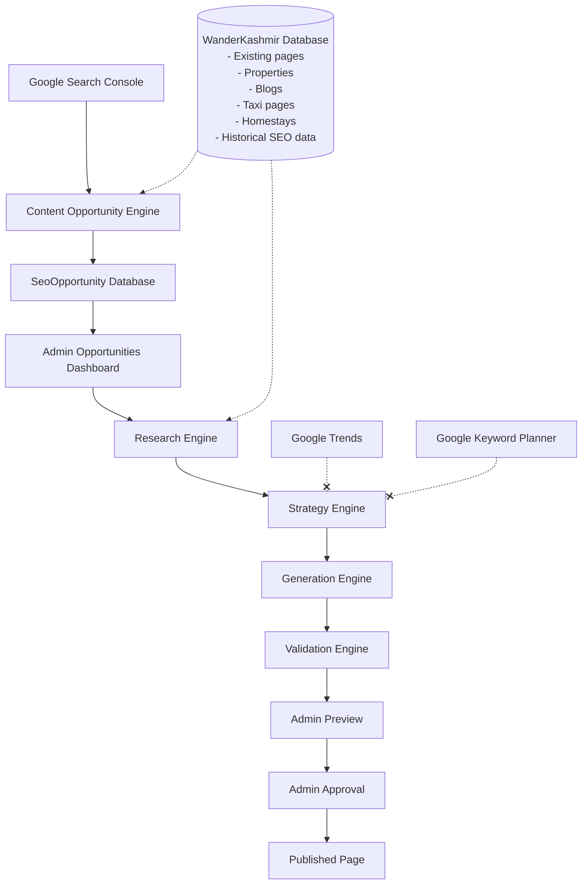

# WanderKashmir SEO Intelligence System
**Complete Architecture, Workflow & Admin Operations Guide**

**Version:** Current production version
**Last Updated:** August 28, 2026
**Architecture Status:** Production Active
**Production Safety Status:** Point-in-Time Recovery (PITR) enabled; Non-destructive update strategy enforced.

---

## SECTION 1 — EXECUTIVE SUMMARY

### What is the SEO Intelligence System?
The SEO Intelligence System is an automated workflow that connects real Google Search Console (GSC) data to WanderKashmir’s content engine. It continuously monitors how users are searching for Kashmir tourism, identifies high-value opportunities, and guides the Admin in optimizing or creating pages to capture that traffic.

### What problem does it solve?
Previously, SEO was a guessing game. Topics were hardcoded or generated without evidence, leading to "zero opportunities" or wasted effort on topics nobody searches for. 

### Core Philosophy
The old hardcoded SEO generation system was replaced to strictly follow this methodology:
**REAL DATA → BETTER DECISIONS → BETTER CONTENT → VALIDATION → HUMAN APPROVAL → PUBLISH**

The system **does NOT** blindly generate SEO pages. It discovers evidence-based opportunities, prepares data-driven strategies, and leaves the final approval entirely in the hands of the human Admin.

---

## SECTION 2 — COMPLETE SYSTEM ARCHITECTURE


*(Note: Dashed lines with an 'x' denote unavailable/disabled providers)*

---

## SECTION 3 — DATA SOURCES

### Google Search Console
**Status:** ACTIVE
- Uses OAuth for secure access.
- Extracts real clicks, impressions, CTR, position, query, and page.
- Uses a rolling current discovery window (90 days).
- Feeds the Opportunity Engine to prove actual search volume before any content is proposed.

### WanderKashmir Database
**Status:** ACTIVE
- Provides context on existing assets (Properties, SEO Landing Pages, Blogs).
- Used to detect cannibalization (multiple pages targeting the same intent).
- Stores historical SEO performance to ensure strong pages are protected.

### Gemini AI
**Status:** ACTIVE
- Used exclusively for:
  - **Strategy:** Organizing research into actionable plans.
  - **Generation:** Drafting content based *only* on the Strategy.
  - **Validation:** Checking the drafted content against safety rules.
- **Gemini does NOT independently decide what content should be generated without research.**

### Google Trends
**Status:** UNAVAILABLE
- No unofficial scraping is used. 

### Google Keyword Planner
**Status:** UNAVAILABLE
- Legitimate API access is not currently configured.

### Paid Keyword Provider
**Status:** DISABLED
- NO PAID KEYWORD PROVIDER IS CURRENTLY USED.

### Paid SERP Provider
**Status:** DISABLED
- NO PAID SERP PROVIDER IS CURRENTLY USED.

---

## SECTION 4 — AUTOMATIC TOPIC DISCOVERY

*"Roz naye topics kahan se aayenge?"*
**Answer:** Google Search Console.

The system does NOT require the Admin to invent a new topic every day. Instead:
1. It pulls the top 500 **GSC queries**.
2. Applies **semantic clustering** to group variations.
3. Infers **search intent** (e.g., Commercial, Local, Informational).
4. Scores **business relevance**.
5. Performs **existing page detection** (matching DB slugs, properties, or GSC URLs).
6. Checks for **cannibalization**.
7. Outputs a continuous 0-100 **opportunity score** and an **action recommendation**.

---

## SECTION 5 — CONTENT OPPORTUNITY ENGINE

**Location:** `src/lib/seo/opportunity-engine.ts`

**Responsibility:** It processes raw GSC data and internal database states to classify what action the business should take.

**Outputs (Action Classifications):**
- **CREATE:** No existing page exists, but the query has meaningful volume and business relevance.
- **OPTIMIZE:** A page exists and is in striking distance, or ranks highly but suffers from a poor Click-Through Rate (CTR deficiency).
- **MONITOR:** A page exists but volume/relevance is too low to prioritize immediate action, or it already ranks top-3 with a healthy CTR.
- **MANUAL_REVIEW:** Multiple pages target the same intent (High Cannibalization Risk). Human intervention is required to decide the primary page.
- **IGNORE:** The query ranks too deep (>20) with no immediate path to page one, or has zero business relevance.

---

## SECTION 6 — OPPORTUNITY SCORING

The current production scoring formula evaluates opportunities on a **continuous 0–100 scale** to ensure high-quality prioritization. It does NOT use coarse bucket scoring and does not let impressions dominate.

1. **Volume Signal:** `Math.min(Math.log10(impressions + 1) * 12, 40)` (Max 40)
2. **Business Relevance:** HIGH (30), MEDIUM (15), LOW (5)
3. **Intent Signal:** TRANSACTIONAL/COMMERCIAL (15), LOCAL (10), INFORMATIONAL (5)
4. **Position Potential:** Ranks 4–10 (15), Ranks 11–20 (10), Ranks 1–3 (5)
5. **CTR Deficiency:** CTR is < 50% of the conservative expectation based on position (15)
6. **Cannibalization:** Highly cannibalized topics force `MANUAL_REVIEW` (+10 points to prioritize the review)

*Gatekeeper:* If the base signal (Volume + Relevance + Intent) is ≤ 5, the query is dropped to prevent database clutter.

---

## SECTION 7 — ACTION CLASSIFICATION

**Decision Tree:**

```text
Existing page?
      |
      YES
      |
Position?
  |
  ├── 1–3
  |     ├── healthy CTR → MONITOR
  |     └── CTR deficiency → OPTIMIZE
  |
  ├── 4–10
  |     ├── meaningful evidence + relevant → OPTIMIZE
  |     └── otherwise → MONITOR/IGNORE
  |
  ├── 11–20
  |     ├── meaningful evidence + relevant → OPTIMIZE
  |     └── otherwise → MONITOR
  |
  └── >20
        → IGNORE / MANUAL_REVIEW if cannibalized

No existing page?
      |
      ├── strong relevant evidence → CREATE
      └── otherwise → IGNORE

Cannibalization?
      |
      HIGH
      ↓
MANUAL_REVIEW
```

**What does MANUAL_REVIEW mean?**
Admin must decide which page should be the primary ranking page for that search intent/entity. It does NOT automatically delete, redirect, merge, or modify pages.

---

## SECTION 8 — CANNIBALIZATION

**What is it?** Multiple existing pages target the same entity or search intent.
**Example Case Study:** *Vergan Resort*

If the system detects that multiple pages are ranking for "Vergan Resort" (e.g., a Property page and a Blog post), the engine forces the action to `MANUAL_REVIEW`.

**Admin Decisions during Manual Review:**
1. Which page is primary?
2. Which intent belongs to that page?
3. Should another page target a different intent?
4. Should pages eventually be consolidated/redirected?
5. Should nothing be changed?

**Golden Rule:**
- NO AUTOMATIC 301
- NO AUTOMATIC DELETE
- NO AUTOMATIC MERGE

---

## SECTION 9 — HISTORICAL SEO PROTECTION

This is the most important safety system. The engine strictly protects existing successful rankings.

**Workflow:**
Research → Historical baseline → Performance delta → Strong / Stable / Improvement Candidate → Strategy

**Component-Level Protection:**
- **PROTECT:** The system must not rewrite a strong component just because AI thinks another keyword sounds better. (e.g., Title → PROTECT)
- **OPTIMIZE:** Minor tweaks permitted.
- **EXPAND:** Adding to existing content.
- **ADD:** Creating entirely new sections (e.g., FAQ → ADD).

The system explicitly uses the `[RETAIN EXISTING]` directive in its generation engine when a component is marked for protection.

---

## SECTION 10 — RESEARCH ENGINE

**Location:** `src/lib/seo/research-engine.ts`

**Gathers:**
- Target & Page type
- GSC signals
- Search intent
- Content gaps & Cannibalization
- Topic cluster
- Historical performance
- Available provider signals

**Graceful Degradation:**
If a provider is unavailable (e.g., Google Trends), it outputs `UNAVAILABLE` and the pipeline continues. It **never fabricates metrics**.

---

## SECTION 11 — STRATEGY ENGINE

**Location:** `src/lib/seo/strategy-engine.ts`

Research goes in. Decision/strategy comes out.

**Outputs:**
- Primary topic
- Queries to protect
- Queries to improve
- Recommended sections
- Internal links
- Component actions (Protect/Optimize/Add)

**Rule:** Historical GSC performance ALWAYS has priority over external AI suggestions.

---

## SECTION 12 — GENERATION ENGINE

**Location:** `src/lib/seo/generation-engine.ts`

- It does NOT blindly rewrite the entire page.
- It strictly follows the Strategy Engine's blueprint.
- Protected components remain untouched.
- Only approved optimization/expansion areas are generated.
- Verified database facts must be used.
- **No fake businesses, phone numbers, placeholders, or fabricated hotel amenities.**

---

## SECTION 13 — VALIDATION ENGINE

**Location:** `src/lib/seo/validation-engine.ts`

Generated content is strictly checked before it can reach publication.

**Checks:**
- Factual accuracy (verified DB facts)
- Heading hierarchy
- Keyword stuffing
- Placeholders left in text
- Strategy compliance
- Hallucinated businesses
- Missing required content

**Validation Result:**
- `PASS`: Content is cleared for Admin Preview.
- `FIX`: Content cannot be published until corrected or manually reviewed.

---

## SECTION 14 — COMPLETE ADMIN WORKFLOW

### DAILY
1. Admin opens: **Admin Panel → SEO Pages → Opportunities**.
2. The Admin sees automatically discovered opportunities.
3. Admin chooses a suitable opportunity.

### MANUAL REFRESH
1. Admin clicks **Refresh Opportunities**.
2. Flow: `Refresh → GSC → Opportunity Engine → Database → UI`

### RESEARCH & APPROVAL
1. Admin clicks **Research**.
2. Flow: `Research → Strategy → Generate → Validate → Preview`.
3. Admin reviews the result in the Preview tab.
4. **Only Admin approval can publish the content.**

---

## SECTION 15 — CRON JOBS

Cron does NOT automatically publish SEO content.

**Current Scheduled Job:** `discover-seo-opportunities`
**Flow:** `Cron → GSC → Opportunity Engine → SeoOpportunity DB`

**Golden Rule of Automation:**
- DISCOVERY = AUTOMATIC
- GENERATION = CONTROLLED
- PUBLISHING = ADMIN APPROVAL

---

## SECTION 16 — DATABASE

**Core Models:**
- `SeoOpportunity`: Stores discovered topics, scores, and engine actions.
- `SeoLandingPage`: The actual published SEO pages.
- `Blog`: Blog posts.
- `Property`: Business listings/hotels.

**Workflow States (SeoOpportunity):**
- `DISCOVERED`: New topic found by the engine.
- `RESEARCHED`: Research engine has gathered context.
- `SELECTED`: Admin has chosen to proceed.
- `GENERATED`: Content is drafted.
- `VALIDATED`: Content passed the Validation Engine.
- `PUBLISHED`: Content is live.
- `RESOLVED`: The topic fell out of the current GSC window but is preserved historically.

---

## SECTION 17 — PRODUCTION SAFETY

- **Authentication:** Admin actions are authenticated via CRM JWT (`CRM_JWT_SECRET`).
- **Cron Authentication:** Protected by `CRON_SECRET`.
- **API Keys:** Server-side only. No `NEXT_PUBLIC` secrets for sensitive keys.
- **Paid Providers:** Disabled by default to prevent runaway costs.
- **Data Protection:** The engine operates on a strictly **NON-DESTRUCTIVE** database rule.

**Forbidden Commands:**
Never use `prisma migrate reset`, `db push --force-reset`, `DROP`, or `TRUNCATE`. Existing production data (especially the `SeoOpportunity` historical log) must be preserved via upsert architecture.

---

## SECTION 18 — ENVIRONMENT VARIABLES

| NAME | PURPOSE | REQUIRED? | SECURITY NOTE |
|------|---------|-----------|---------------|
| `DATABASE_URL` | Main Postgres Connection | YES | Contains credentials |
| `CRM_DATABASE_URL` | CRM Postgres Connection | YES | Contains credentials |
| `GEMINI_API_KEY` | Powers AI Strategy/Generation | YES | Server-side only |
| `GOOGLE_CLIENT_ID` | GSC OAuth Identification | YES | Server-side only |
| `GOOGLE_CLIENT_SECRET` | GSC OAuth Secret | YES | Server-side only |
| `GOOGLE_REDIRECT_URI` | GSC OAuth Callback | YES | Server-side only |
| `CRON_SECRET` | Secures cron execution | YES | Server-side only |
| `CRM_JWT_SECRET` | Admin Authentication | YES | Server-side only |
| `UPSTASH_REDIS_REST_URL` | Redis Caching URL | YES | Server-side only |
| `UPSTASH_REDIS_REST_TOKEN` | Redis Caching Token | YES | Server-side only |
| `RESEND_API_KEY` | Email provider | YES | Server-side only |
| `NEXT_PUBLIC_APP_URL` | Base domain for frontend | YES | Safe for client |

*(Note: The `CRON_SECRET` is generated manually in the Vercel dashboard and matched in external scheduling tools like Vercel Cron or GitHub Actions).*

---

## SECTION 19 — IMPORTANT FILE MAP

| File | Responsibility |
|------|----------------|
| `src/lib/seo/opportunity-engine.ts` | GSC data ingestion, clustering, scoring, and action classification. |
| `src/lib/seo/research-engine.ts` | Gathers context, history, and provider signals. |
| `src/lib/seo/strategy-engine.ts` | Formulates the blueprint and protection plan. |
| `src/lib/seo/generation-engine.ts` | Drafts content based exclusively on the Strategy. |
| `src/lib/seo/validation-engine.ts` | Enforces safety, factual accuracy, and QA checks. |
| `src/lib/seo/research/providers.ts` | Interfaces for external data (Google Trends, GKP). |
| `src/actions/admin-seo.ts` | Admin actions (Triggering cron, generating content). |
| `src/app/api/cron/discover-seo-opportunities/route.ts` | Serverless route executing the automated discovery cron. |
| `prisma/schema.prisma` | Source of truth for database models and states. |

---

## SECTION 20 — REAL EXAMPLES

Verified outcomes from the actual scoring engine:

### Vergan Resort
**Action:** `MANUAL_REVIEW`
**Why:** Extremely high relevance and volume, but multiple existing pages target it (Cannibalization Risk). Admin must untangle it.

### Keran Valley Homestay
**Action:** `MANUAL_REVIEW`
**Why:** Very high relevance (Score: 92) and volume, currently ranking, but CTR deficiency or cannibalization flags require a human decision before optimization.

### Pine Palace Hotel Gulmarg
**Action:** `IGNORE`
**Why:** Score 0. The page ranks too deep (Pos 46.0). Current GSC evidence does not indicate a near-term page-one opportunity.

### Salamabad
**Action:** `MONITOR`
**Why:** Score 62. It is in striking distance (Pos 8.7), but currently has insufficient volume or business relevance to prioritize immediate optimization over higher-value targets.

### What Is The Other Name For Oont Kadal In Kashmir?
**Action:** `MONITOR`
**Why:** Score 64. Page 2 ranking, but evidence is not strong enough to prioritize over immediate commercial targets.

---

## SECTION 21 — WHAT ADMIN SHOULD DO EVERY DAY

1. Open SEO → Opportunities.
2. Review top opportunities.
3. Start with the highest-value, clean opportunity (e.g., `OPTIMIZE` or `CREATE`).
4. Avoid `MANUAL_REVIEW` until page ownership and cannibalization is understood.
5. Click **Research**.
6. Review the Research output.
7. Review the Strategy output.
8. Click **Generate**.
9. Review Validation results (Fix if necessary).
10. Preview the changes.
11. **Approve only if correct.**
12. Publish.
13. Later, monitor GSC performance to see the impact.

---

## SECTION 22 — FUTURE WORK

*(These are possibilities, NOT currently active features in production).*
- Legitimate Google Trends integration.
- Legitimate Google Keyword Planner integration.
- Permanent historical GSC snapshots.
- Improved semantic clustering models.
- Additional research providers.

*Paid providers remain disabled unless explicitly changed by the project owner.*

---

## SECTION 23 — TROUBLESHOOTING

| Problem | Check |
|---------|-------|
| **Opportunities empty** | GSC connection, Refresh logic, API limits, Database connectivity, date range, or system logs. |
| **Old classifications appear** | SeoOpportunity persistence (upsert), cache invalidation, manual refresh trigger. |
| **Page returns 404** | Public route mapping, slug accuracy, workflowState, publishing status, ISR/cache. |
| **GSC unavailable** | OAuth status, refresh token expiry, Google Cloud configuration. |
| **Validation = FIX** | This is a safety result, not a system failure. The generated text hallucinated or failed guidelines. Review manually. |

---

## SECTION 24 — MASTER FLOW DIAGRAM

```text
GOOGLE SEARCH CONSOLE
      ↓
REAL SEARCH DATA
      ↓
OPPORTUNITY ENGINE
      ↓
WHAT SHOULD WE WORK ON?
      ↓
┌───────────────┐
│ CREATE        │
│ OPTIMIZE      │
│ MONITOR       │
│ MANUAL REVIEW │
│ IGNORE        │
└───────────────┘
      ↓
ADMIN CHOOSES
      ↓
RESEARCH
      ↓
STRATEGY
      ↓
GENERATION
      ↓
VALIDATION
      ↓
PREVIEW
      ↓
ADMIN APPROVAL
      ↓
PUBLISH
      ↓
GSC MEASUREMENT
      ↓
NEXT OPPORTUNITY
```

---

## SECTION 25 — GOLDEN RULES

1. Real GSC data only.
2. Never fabricate SEO metrics.
3. Protect successful SEO.
4. Small evidence-based improvements over blind rewrites.
5. Never blindly rewrite existing pages.
6. Cannibalization requires human review.
7. No automatic deletion/redirect/merge.
8. AI-generated content must pass validation.
9. Cron discovers; Admin controls publishing.
10. **Existing production data must never be destroyed.**
11. Paid SEO providers are disabled.
12. Precision is more important than opportunity count.
